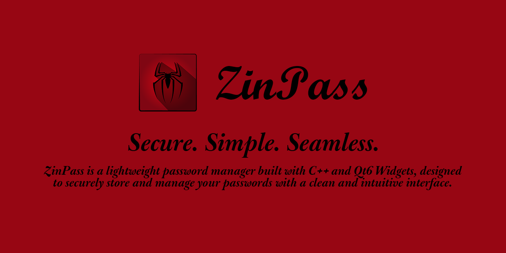
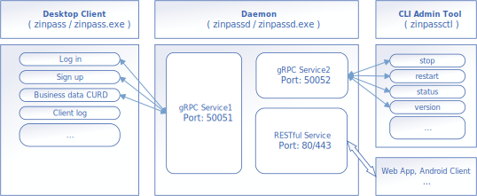

# ZinPass 密码管理器

    
    
ZinPass is a lightweight password manager built with C++ and Qt6 Widgets, designed to securely store and manage your passwords with a clean and intuitive interface.

## 🗂️ Contents - 目录
- [ZinPass 密码管理器](#zinpass-密码管理器)
  - [🗂️ Contents - 目录](#️-contents---目录)
  - [🛡️ 一、简介](#️-一简介)
  - [🛠️ 二、构建与安装](#️-二构建与安装)
  - [⚙️ 三、使用](#️-三使用)
  - [⚡ 四、重要说明](#-四重要说明)
    - [数据使用](#数据使用)
    - [项目开发](#项目开发)
  - [©️ 五、版权与免责声明](#️-五版权与免责声明)
    - [许可协议 License](#许可协议-license)
    - [免责声明](#免责声明)

## 🛡️ 一、简介
ZinPass 是一款轻量级密码管理器，分为三部分：
- `zinpass` 客户端，负责客户端交互，使用 Qt6 Widget 开发
- `zinpasssvc` / `zinpassd` 服务端，部署在 Linux 上为守护进程，负责后端数据处理，使用 gRPC 通信，使用 SQLite3 存储数据，使用 OpenSSL 加密数据（目前版本只加密密码字段）。
- `zinpassctl` 管理工具，负责监控和控制服务端后台进程。服务端没有控制台和图形化界面，监控和控制需要此工具。  

---

## 🛠️ 二、构建与安装

本软件区分服务端和客户端，请根据自己的需求选择合适的版本进行部署和安装。  

- 若你没有个人服务器，只希望本地运行，例如安装在 *Windows x86_64* 平台的电脑上使用，请选择下载 *Windows x86_64* 版本的服务端程序 `zinpasssvc.exe` 和客户端程序 `zinpass.exe`，按照推荐的目录结构安装部署。 

- 若你有个人服务器，例如 *Debian, Ubuntu, Fedora, CentOS, etc*，希望随时随地管理个人数据，可下载 *Linux x86_64* 版本的服务端程序 `zinpassd` 部署在服务器上，搭配 Windows 版本的 `zinpass.exe` 使用（假设你的笔记本电脑是 *Windows* 的）。或者根据你的使用需求自由搭配。

- 你可以根据服务端需要的 *API* 自行开发一个 `Web` 应用部署在服务器上，这样就可以通过网页的形式随时随地管理个人数据。需要注意的是，通信使用 *gRPC* 。后续我可能会实现这个功能。

注意：请你自行解决网络问题，确保服务器与客户端能正常通信（服务器公网 IP 或同一局域网内，开放防火墙和端口）。

请点击 [构建与安装](docs/build.md) 查阅构建与安装部署说明。

## ⚙️ 三、使用

请点击 [使用手册](docs/user_manual/main.md) 查阅使用手册。

## ⚡ 四、重要说明

### 数据使用
- 密码数据完全由用户自行管理，开发者不会收集任何用户信息。若用户担心数据泄露风险，可将服务端和客户端部署在同一主机上，并限制服务端仅监听本机地址的请求，拦截外部请求。 

- 若服务端和客户端部署在同一主机上，建议用户及时备份数据，直接备份 `zinpass.db` 这个文件就行。但是目前版本不太稳定，不保证兼容前一版本，备份 `zinpass.db` 文件前请同时记录 `zinpass.db` 是配套哪个版本的软件。

### 项目开发
- 这个程序只实现了少数几个最基本的功能，还有很多功能未实现。
- 目前没啥精力更新，且每次更新大概率都是破坏性更新，完全不保证向后兼容，甚至不保证向前兼容。
- 有时候生产环境的版本的代码也可能越修复 BUG 越多，勉强使用，不保证修复时效。
- 若存在故障，可提交 issue 到 GitHub，或邮件留言。

## ©️ 五、版权与免责声明

### 许可协议 License  

- 本项目基于 **[GNU General Public License v3.0](LICENSE)** 开源协议发布。您可以自由地使用、修改和分发本软件，但必须遵循该协议的规定。  

> GNU GPLv3 的**唯一官方版本**是由自由软件基金会（*FSF*）发布的[英文原版](https://www.gnu.org/licenses/gpl-3.0.en.html)。
> 任何其他语言的翻译，包括中文，都被视为“非官方”（unofficial）或“非授权”（unauthorized）的版本。它们在法律上不具有与英文原版同等的效力。

- 此处提供由 *[开放原子开源基金会（OpenAtom）](https://www.openatom.org/)* 发布或组织翻译的 **非官方中文翻译** **[GNU GPL v.3.0 - 阮坤良 [简体]](docs/license_translation/LICENSE.zh-CN.KunliangLuan)** 和 **[GNU GPL v.3.0 - 卫剑钒 [人话版]](docs/license_translation/LICENSE.zh-CN.JianfanWei.md)** ，仅供参考。如果翻译版本与英文原版有任何冲突，以英文原版为准。

### 免责声明

- 使用者在使用本软件时，必须**严格遵守其所在国家/地区的法律法规**，并承担因使用本软件而产生的一切法律责任。

- **严禁**将本软件用于任何非法目的。开发者**概不负责**因使用者违法使用本软件而造成的任何后果。

- 本软件按“原样”提供，**不提供任何形式的明示或暗示担保**，包括但不限于对适销性、特定用途适用性的担保。使用本软件所造成的一切**数据丢失、财产损失或任何其他风险**，均由使用者自行承担。

---
END

