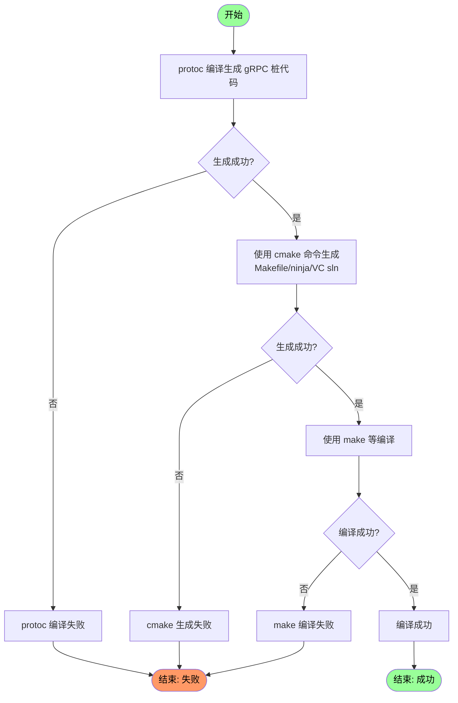

# Build - 构建说明

构建 ZinPass 应用步骤说明和示例。目前只支持 x86_64 架构的 Windows 和 GNU/Linux 平台。aarch64 架构暂不支持。

## Contents - 目录
- [Build - 构建说明](#build---构建说明)
  - [Contents - 目录](#contents---目录)
  - [一、Dependencies - 依赖](#一dependencies---依赖)
    - [Compiling environment - 编译环境](#compiling-environment---编译环境)
    - [Third-Party libraries - 第三方库](#third-party-libraries---第三方库)
  - [二、Build - 构建](#二build---构建)
  - [三、Install - 安装](#三install---安装)
    - [部署服务端和命令行程序](#部署服务端和命令行程序)
    - [创建配置文件](#创建配置文件)
    - [安装桌面端程序](#安装桌面端程序)
  - [四、Verification - 验证](#四verification---验证)
  - [五、Clean - 清理](#五clean---清理)

## 一、Dependencies - 依赖
以下工具链与第三方库版本均为笔者开发环境上的版本，其他版本请自行测试。

### Compiling environment - 编译环境

***Windows***
- Python 3.13.3
- CMake version 3.31.0
- MinGW-w64 x86_64-posix-seh-rev2 g++ 14.2.0
- libprotoc 29.0

***GNU/Linux***

### Third-Party libraries - 第三方库


***Windows***

- Qt 6.9
- gRPC (含 protoc 工具)
- SQLite 3.50
- OpenSSL 3.0.15
- Boost

***GNU/Linux***
- Qt 
- gRPC
- SQLite
- OpenSSL
- Boost


## 二、Build - 构建

Generate Stubs and Compile .proto files  
生成桩代码和编译 .protoc 文件  

Generate Makefile/Ninja/VS sln  
生成 Makefile 或 Ninja 或 VC sln

构建流程图  




构建命令示例：  
Windows, MinGW-w64, PowerShell
```pwsh
Set-Location -Path "zinpass" # 切换目录至项目根目录
python scripts/protoc.py "D:\applib\grpc-1.71.0-amd64-win-mingw64" -c 111 # 生成桩代码和编译 .protoc 文件，自行替换 grpc 目录
New-Item -ItemType Directory -Path "build" -Force; Set-Location -Path "build" # 创建并切换至目录 build 
cmake ../ -G "MinGW Makefiles" -DCMAKE_BUILD_TYPE=Release # 
mingw32-make -j$env:NUMBER_OF_PROCESSORS # 使用与 CPU 核心数相同的线程数编译
```
Windows, MinGW-w64, CMD
```cmd
REM 参数 /D 允许同时改变当前驱动器（如果需要）
CD /D zinpass
python scripts/protoc.py "D:\applib\grpc-1.71.0-amd64-win-mingw64" -c 111
MD build & CD build
cmake ../ -G "MinGW Makefiles" -DCMAKE_BUILD_TYPE=Release
mingw32-make -j%NUMBER_OF_PROCESSORS%
```

Windows, MSYS2 MINGW64, Bash
```bash
# 同 GNU/Linux, GCC, Bash 项，见后文
```

Windows, Developer Command Prompt for VS (MSVC CMD)  
```cmd
REM 目前不推荐 VC 编译器，需要改动较多代码
```

GNU/Linux, GCC, Bash
```bash
# -DCMAKE_C_COMPILER=gcc -DCMAKE_CXX_COMPILER=g++ 是默认行为，可缺省
cd zinpass && python scripts/protoc.py "/opt/grpc-1.71.0-amd64-linux-gcc" -c 111 # 生成桩代码和编译 .protoc 文件
mkdir -p build && cd build && \
cmake ../ -DCMAKE_C_COMPILER=gcc -DCMAKE_CXX_COMPILER=g++ -DCMAKE_BUILD_TYPE=Release && \
make -j$(nproc)
```

GNU/Linux, Clang, Bash
```bash
cd zinpass && python scripts/protoc.py "/opt/grpc-1.71.0-amd64-linux-gcc" -c 111 # 生成桩代码和编译 .protoc 文件
mkdir -p build && cd build && \
cmake ../ -DCMAKE_C_COMPILER=clang -DCMAKE_CXX_COMPILER=clang++ -DCMAKE_BUILD_TYPE=Release && \
make -j$(nproc)
```

## 三、Install - 安装

### 部署服务端和命令行程序
***GNU/Linux***  
```bash
sudo vim ~/.bashrc # 编辑 ~/.bashrc 文件

# 在 ~/.bashrc 尾部追加下列内容（依据实际路径修改）
alias zinpassd='absolute/path/zinpassd'
alias zinpassctl='absolute/path/zinpassctl'
```
***Windows***  
在目录 `%SystemRoot%` 创建 bat 脚本  

PowerShell cmd-let
```pwsh
Write-Output "" > $env:SystemRoot\zinpasssvc.bat # 创建/清空
notepad $env:SystemRoot\zinpasssvc.bat # 编辑
```

或 CMD DOS命令（效果同上）
```cmd
ECHO "" > %SystemRoot%\zinpasssvc.bat
notepad %SystemRoot%\zinpasssvc.bat
```

在其中编辑以下内容（依据实际路径修改）
```cmd
@echo off
"absolute\path\zinpasssvc.exe" %*
```

### 创建配置文件
在 `zinpassd` 或 `zinpasssvc.exe` 所在目录下创建文件 `service.config` 并编辑

```ini
database = "../data/zinpass.db"
log = "../data/service.log"
```

database 为数据存储路径  
log 为服务端的日志输出路径  

### 安装桌面端程序
将 `zinpass` 或 `zinpass.exe` 移动到安装目录，复制动态链接库，创建软链接或创建快捷方式。  

也添加环境变量（optional 可选），这样就可以在命令行中使用了。


## 四、Verification - 验证
到安装目录

## 五、Clean - 清理
Windows, PowerShell
```pwsh
Set-Location -Path .. # 切换目录至父目录（项目根目录）
Remove-Item -Recurse -Force build # 递归强制删除目录 build
```

Windows, CMD
```cmd
CD ..
RMDIR build
```

GNU/Linux, Bash
```bash
cd .. # 切换至父目录（项目根目录）
rm -rf build
```

---
END