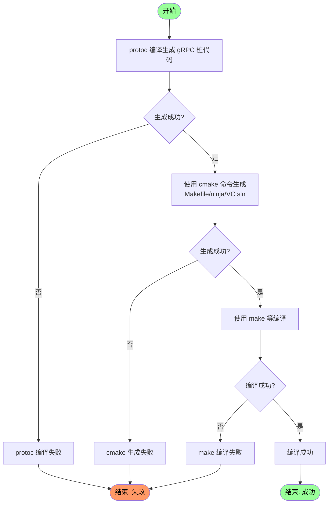

# Build - 构建说明

构建 `ZinPass` 应用步骤说明和示例。目前只支持 `x86_64` 架构的 `Windows` 和 `GNU/Linux` 平台。`aarch64` 架构暂不支持，`macOS` 暂不支持。

## Contents - 目录
- [Build - 构建说明](#build---构建说明)
  - [Contents - 目录](#contents---目录)
  - [一、Dependencies - 依赖](#一dependencies---依赖)
    - [1.1. Compiling environment - 编译环境](#11-compiling-environment---编译环境)
    - [2.2. Third-Party libraries - 第三方库](#22-third-party-libraries---第三方库)
  - [二、Build - 构建](#二build---构建)
    - [2.1. 构建流程](#21-构建流程)
    - [2.2. Windows 平台构建命令示例](#22-windows-平台构建命令示例)
    - [2.3. GNU/Linux 平台构建命令示例](#23-gnulinux-平台构建命令示例)
    - [2.4. macOS 平台构建命令示例](#24-macos-平台构建命令示例)
  - [三、Install - 安装](#三install---安装)
    - [3.1. 部署服务端和命令行程序](#31-部署服务端和命令行程序)
    - [3.2. 创建配置文件](#32-创建配置文件)
    - [3.3. 安装桌面端程序](#33-安装桌面端程序)
  - [四、Verification - 验证](#四verification---验证)
  - [五、Clean - 清理](#五clean---清理)

## 一、Dependencies - 依赖
以下工具链与第三方库版本均为笔者开发环境上的版本，其他版本请自行测试。

### 1.1. Compiling environment - 编译环境

> 以下环境为笔者开发和测试时使用的版本

***Windows***
- CMake: cmake version 3.31.0
- MinGW-w64:
    - gcc.exe (x86_64-posix-seh-rev2, Built by MinGW-Builds project) 14.2.0
    - g++.exe (x86_64-posix-seh-rev2, Built by MinGW-Builds project) 14.2.0
    - GNU Make 4.4.1 Built for x86_64-w64-mingw32
- Ninja: 1.12.1
- gRPC:
    - protoc: libprotoc 29.0
    - grpc_cpp_plugin.exe
    - gRPC 1.71.0 (使用 mingw-w64 编译后的 Release 静态库，包含 libprotoc 29.0 )
- Python: Python 3.13.3
- SQLite: 3.50.0 (使用 mingw-w64 编译后的 Release 静态库)
- OpenSSL: OpenSSL 3.5.0 8 Apr 2025 (Library: OpenSSL 3.5.0 8 Apr 2025)
- Boost: 1.88.0
- Qt: 6.9 (使用 mingw-w64 编译后的 Release 静态库)

***GNU/Linux***

### 2.2. Third-Party libraries - 第三方库


***Windows***

- Qt 6.9
- gRPC (含 protoc 工具)
- SQLite 3.50
- OpenSSL 3.0.15
- Boost

***GNU/Linux***
- Qt 
- gRPC
- SQLite
- OpenSSL
- Boost


## 二、Build - 构建

### 2.1. 构建流程

Generate Stubs and Compile .proto files  
生成桩代码和编译 .proto 文件  

Generate Makefile/Ninja/VS sln  
生成 Makefile 或 Ninja 或 VC sln

构建流程图  


```mermaid
graph TB
    Start([开始]) --> Protoc[protoc 编译生成 gRPC 桩代码]
    
    Protoc --> CheckProtocSuccess{生成成功?}
    
    CheckProtocSuccess -->|否| ProtocFail[protoc 编译失败]
    ProtocFail --> EndFail([结束: 失败])
    
    CheckProtocSuccess -->|是| Cmake[使用 cmake 命令生成<br>Makefile/ninja/VC sln]
    
    Cmake --> CheckCmakeSuccess{生成成功?}
    
    CheckCmakeSuccess -->|否| CmakeFail[cmake 生成失败]
    CmakeFail --> EndFail
    
    CheckCmakeSuccess -->|是| Make[使用 make 等编译]
    
    Make --> CheckMakeSuccess{编译成功?}
    
    CheckMakeSuccess -->|否| MakeFail[make 编译失败]
    MakeFail --> EndFail
    
    CheckMakeSuccess -->|是| Success[编译成功]
    Success --> EndSuccess([结束: 成功])
    
    style Start fill:#9f9,color:black
    style EndSuccess fill:#9f9,color:black
    style EndFail fill:#f96,color:black
```


### 2.2. Windows 平台构建命令示例
1. ***Windows, MinGW-w64***

(1) 在 `PowerShell` 或 `pwsh` 中执行下列命令
```pwsh
<#
  "zinpass" 替换为项目根目录路径
  "D:\applib\grpc-1.71.0-amd64-win-mingw64" 替换为实际 gRPC 库的 HOME 路径
  $env:NUMBER_OF_PROCESSORS 可被省略，即让 CMake 自动选择并行数
#>

Set-Location -Path "zinpass"
python scripts/protoc.py "D:\applib\grpc-1.71.0-amd64-win-mingw64" -c 111
cmake -S . -B build -G "MinGW Makefiles" -DCMAKE_BUILD_TYPE=Release
cmake --build build --parallel $env:NUMBER_OF_PROCESSORS
```
或执行下列更传统的命令
```pwsh
<#
  1. 切换目录至项目根目录
  2. 编译 Protocol Buffers 的 .proto 文件生成数据访问代码
  3. 创建并切换至目录 ./build/ 
  4. 为 MinGW 生成 Release 版本的 Makefile 构建文件（Configure and Generate）
  5. 使用 mingw32-make 按 CPU 核心数多线程并行编译
#>

Set-Location -Path "zinpass"
python scripts/protoc.py "D:\applib\grpc-1.71.0-amd64-win-mingw64" -c 111
New-Item -ItemType Directory -Path "build" -Force; Set-Location -Path "build"
cmake .. -G "MinGW Makefiles" -DCMAKE_BUILD_TYPE=Release
mingw32-make -j$env:NUMBER_OF_PROCESSORS
```

(2) 在 `CMD` 中执行下列命令
```cmd
REM  "zinpass" 替换为项目根目录路径，参数 /D 允许同时改变当前驱动器（如果需要）
REM  "D:\applib\grpc-1.71.0-amd64-win-mingw64" 替换为实际 gRPC 库的 HOME 路径
REM  %NUMBER_OF_PROCESSORS% 可被省略，即让 CMake 自动选择并行数

CD /D zinpass
python scripts/protoc.py "D:\applib\grpc-1.71.0-amd64-win-mingw64" -c 111
cmake -S . -B build -G "MinGW Makefiles" -DCMAKE_BUILD_TYPE=Release
cmake --build build --parallel %NUMBER_OF_PROCESSORS%
```
或执行下列更传统的命令
```cmd
CD /D "zinpass"
python scripts/protoc.py "D:\applib\grpc-1.71.0-amd64-win-mingw64" -c 111
MD build & CD build
cmake .. -G "MinGW Makefiles" -DCMAKE_BUILD_TYPE=Release
mingw32-make -j%NUMBER_OF_PROCESSORS%
```

2. ***Windows, MSYS2***

在 `MSYS2 MINGW64`、`MSYS2 CLANG64` 或 `MSYS2 UCRT64`中编译，请参考 GNU/Linux 项
```bash
# 略
```

3. ***Windows, MSVC***  

(1) 在 `Developer PowerShell for VS 2022` 中执行下列命令
```pwsh
<#
  目前不推荐 VC 编译器，原因是：
  1. 未适配 MSVC 编译器，可能需要改动较多代码
  2. 本程序客户端部分使用了 Qt 库，跨平台编译更推荐 GCC
  3. MSVC 是闭源实现，更偏好开源的 GCC
  4. 使用不同的编译器分别编译和适配第三方库的时间与精力成本较大
  必须确保第三方库和程序使用同一类型的编译器：
  MinGW 编译的程序不能链接 MSVC 编译的库
  MSVC 编译的程序不能链接 MinGW 编译的库
#>
# 参考命令：
Set-Location -Path "zinpass"
python scripts/protoc.py "D:\applib\grpc-1.71.0-amd64-win-mingw64" -c 111
cmake -S . -B build -G "Visual Studio 17 2022" -A x64
cmake --build build --parallel $env:NUMBER_OF_PROCESSORS --config Release
```
(2) 在 `Developer Command Prompt for VS 2022` 中执行下列命令
```cmd
REM 目前不推荐 VC 编译器，原因同上
```

### 2.3. GNU/Linux 平台构建命令示例

1. ***GNU/Linux, GCC***

在 `Bash` 中执行下列命令
```bash
#  "zinpass" 替换为项目根目录路径
#  "/opt/grpc-1.71.0-amd64-linux-gcc" 替换为实际 gRPC 库的 HOME 路径
#  $(nproc) 可被省略，即让 CMake 自动选择并行数

cd "zinpass" && python "scripts/protoc.py" "/opt/grpc-1.71.0-amd64-linux-gcc" -c 111
cmake -S . -B build -DCMAKE_BUILD_TYPE=Release
cmake --build build --parallel $(nproc)
```
或执行下列更传统的命令
```bash
#  1. 切换目录至项目根目录
#  2. 编译 .proto 文件
#  3. 创建并切换至 ./build/ 目录
#  4. 配置项目，并编译项目

cd "zinpass"
python "scripts/protoc.py" "/opt/grpc-1.71.0-amd64-linux-gcc" -c 111
mkdir -p build && cd build
cmake .. -G "Unix Makefiles" -DCMAKE_C_COMPILER=gcc -DCMAKE_CXX_COMPILER=g++ -DCMAKE_BUILD_TYPE=Release && make -j$(nproc)

# -G "Unix Makefiles" -DCMAKE_C_COMPILER=gcc -DCMAKE_CXX_COMPILER=g++ 是默认行为，可缺省为:
cmake .. -DCMAKE_BUILD_TYPE=Release && make -j$(nproc)
```

2. ***GNU/Linux, Clang***

在 `Bash` 中执行下列命令
```bash
#  "zinpass" 替换为项目根目录路径
#  "/opt/grpc-1.71.0-amd64-linux-gcc" 替换为实际 gRPC 库的 HOME 路径
#  $(nproc) 可被省略，即让 CMake 自动选择并行数

cd "zinpass" && python "scripts/protoc.py" "/opt/grpc-1.71.0-amd64-linux-gcc" -c 111
cmake -S . -B build -DCMAKE_C_COMPILER=clang -DCMAKE_CXX_COMPILER=clang++ -DCMAKE_BUILD_TYPE=Release
cmake --build build --parallel $(nproc)
```
或执行下列更传统的命令
```bash
cd "zinpass"
python "scripts/protoc.py" "/opt/grpc-1.71.0-amd64-linux-gcc" -c 111
mkdir -p build && cd build
cmake .. -DCMAKE_C_COMPILER=clang -DCMAKE_CXX_COMPILER=clang++ -DCMAKE_BUILD_TYPE=Release && make -j$(nproc)
```

### 2.4. macOS 平台构建命令示例

> 由于本人没有 Macintosh 电脑，笔记本搭载的 AMD CPU 难以搭建 macOS 的虚拟化开发环境，暂时也不太熟悉 GitHub Actions ，因此短时间内不会适配 macOS 

## 三、Install - 安装

### 3.1. 部署服务端和命令行程序
***GNU/Linux***  
```bash
sudo vim ~/.bashrc # 编辑 ~/.bashrc 文件

# 在 ~/.bashrc 尾部追加下列内容（依据实际路径修改）
alias zinpassd='absolute/path/zinpassd'
alias zinpassctl='absolute/path/zinpassctl'
```
***Windows***  
在目录 `%SystemRoot%` 创建 bat 脚本  

PowerShell cmd-let
```pwsh
Write-Output "" > $env:SystemRoot\zinpasssvc.bat # 创建/清空
notepad $env:SystemRoot\zinpasssvc.bat # 编辑
```

或 CMD DOS命令（效果同上）
```cmd
ECHO "" > %SystemRoot%\zinpasssvc.bat
notepad %SystemRoot%\zinpasssvc.bat
```

在其中编辑以下内容（依据实际路径修改）
```cmd
@echo off
"absolute\path\zinpasssvc.exe" %*
```

### 3.2. 创建配置文件
在 `zinpassd` 或 `zinpasssvc.exe` 所在目录下创建文件 `service.config` 并编辑
修改其中的数据库文件路径为你的实际数据库文件完整路径

```ini
database = "../data/zinpass.db"
log = "../data/service.log"
```

database 为数据存储路径  
log 为服务端的日志输出路径  

### 3.3. 安装桌面端程序
将 `zinpass` 或 `zinpass.exe` 移动到安装目录，复制动态链接库，创建软链接或创建快捷方式。  

也添加环境变量（optional 可选），这样就可以在命令行中使用了。


## 四、Verification - 验证
略。

## 五、Clean - 清理
删除 `./build/` 目录即可，若不再需要源代码，可直接完整删除 `zinpass` 目录。  
以下是删除 `./build/` 目录的参考命令

`PowerShell`
```pwsh
Set-Location -Path .. # 切换目录至父目录（项目根目录）
Remove-Item -Recurse -Force build # 递归强制删除目录 build
```

`CMD`
```cmd
CD ..
RMDIR build
```

`GNU/Linux, Bash`
```bash
cd .. # 切换至父目录（项目根目录）
rm -rf build
```

---
END