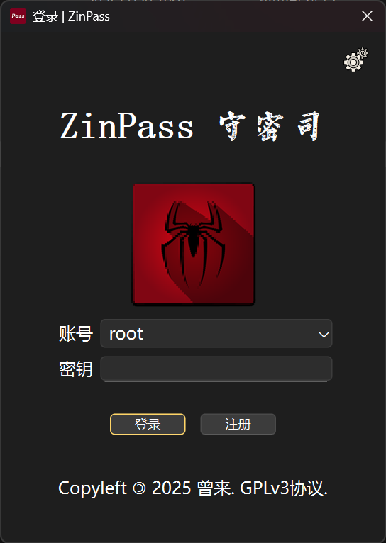
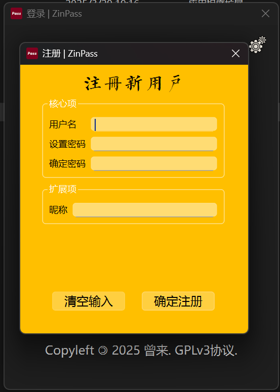
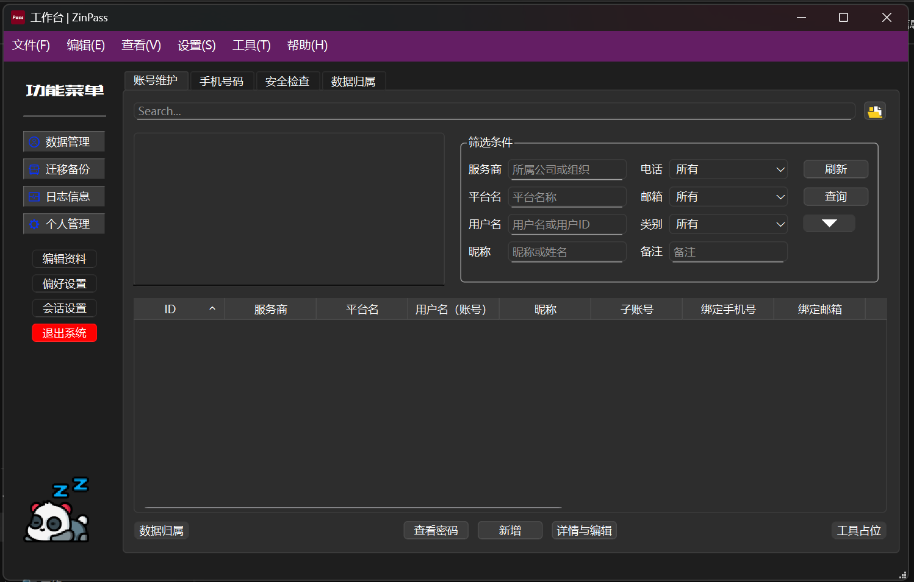
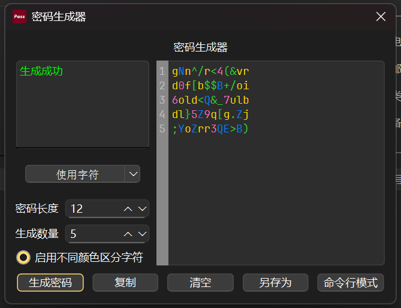
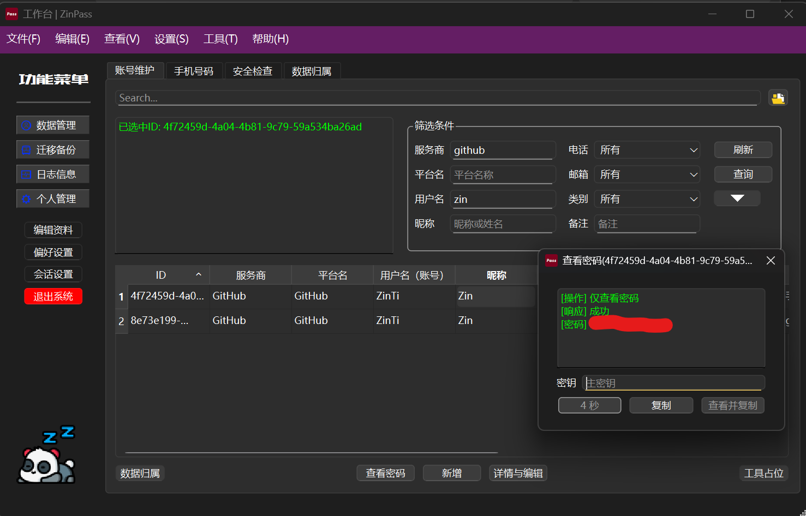

# Manual - 使用手册

## Contents - 目录
- [Manual - 使用手册](#manual---使用手册)
  - [Contents - 目录](#contents---目录)
  - [Main Text - 正文](#main-text---正文)
    - [启动、注册与登录](#启动注册与登录)
    - [停用服务器](#停用服务器)
    - [主工作台介绍](#主工作台介绍)
    - [工具栏介绍](#工具栏介绍)
  - [其他](#其他)

## Main Text - 正文

### 启动、注册与登录
1. 运行 `zinpasssvc` 启动服务端后台进程。因运行在后台，所以不会显示任何控制台或图形界面，这是正常现象。

2. 启动 `zinpass` 客户端，登录或注册账号使用。登录界面如图 3-1 所示，账号处会自动列出所有已存在的用户名，请选择用户名，然后输入密码登录。

    
    <figcaption style="font-style: italic; font-size: smaller; margin-top: 5px;">图3-1 登录界面</figcaption>

3. 注册账号如图 3-2 所示，输入用户名、密码、确认密码、昵称等信息，点击注册按钮完成注册。

    
    <figcaption style="font-style: italic; font-size: smaller; margin-top: 5px;">图3-2 注册界面</figcaption>

### 停用服务器
4. 若用户需要关闭 `zinpasssvc` 进程，需要使用 `zinpassctl` 工具，在该工具的交互命令中，输入 `stop` 命令即可通知服务器停止服务。

### 主工作台介绍

5. 登录成功后即进入工作台界面，在工作台界面进行各种操作。工作台顶部为菜单栏，左侧为功能导航区，右侧为工作区。如图 3-3 所示。

<figure style="text-align: center;">
  
  <figcaption style="font-style: italic; font-size: smaller; margin-top: 5px;">图3-3 工作台界面</figcaption>
</figure>

6. 需要注意的是，会话超时自动过期，会话过期时查询不到任何数据，客户端也不会提示会话过期，请自行退出重新登录（这一问题是设计缺陷，将在后续版本中解决）。

7. 在工作台界面顶部菜单栏中，预留了一些菜单项，这些菜单项暂时没有实现，但保留了位置，以供以后扩展。其中 工具栏 - 密码生成器 功能已经实现，所以此处以密码生成器功能为例，展示一下其功能界面。如图 3-4 所示。

<figure style="text-align: center;">
  
  <figcaption style="font-style: italic; font-size: smaller; margin-top: 5px;">图3-4 工具-密码生成器</figcaption>
</figure>

### 工具栏介绍

8. 密码生成器功能支持生成随机密码，你可以指定密码长度、生成数量、包含的字符类型（数字、大小写字母与特殊字符），根据需要选择不同参数生成密码。可以点击命令行模式，提供了另一个独立的随机密码生成器的程序，即 `bin/pwdgen` 程序。

9. 查看密码功能示例，支持 “查看 | 复制 | 查看并复制” 三种方式。查看密码后仅显示几秒钟，如图 3-5 所示。这样设计的目的是，有时候用户查看完密码，但来不及/忘记关闭窗口，此时屏幕可能会被恶意程序或不法分子窥窃到，因此设计了一个倒计时，且时间比较短。推荐使用复制功能，复制功能不会明文显示密码，可以粘贴到其他地方使用。不过复制也存在被其他程序读取粘贴板的风险，后续版本将会实现一个隔离的粘贴板，以防止数据泄露。

<figure style="text-align: center;">
  
  <figcaption style="font-style: italic; font-size: smaller; margin-top: 5px;">图3-5 读取密码</figcaption>
</figure>

## 其他
无。

***
